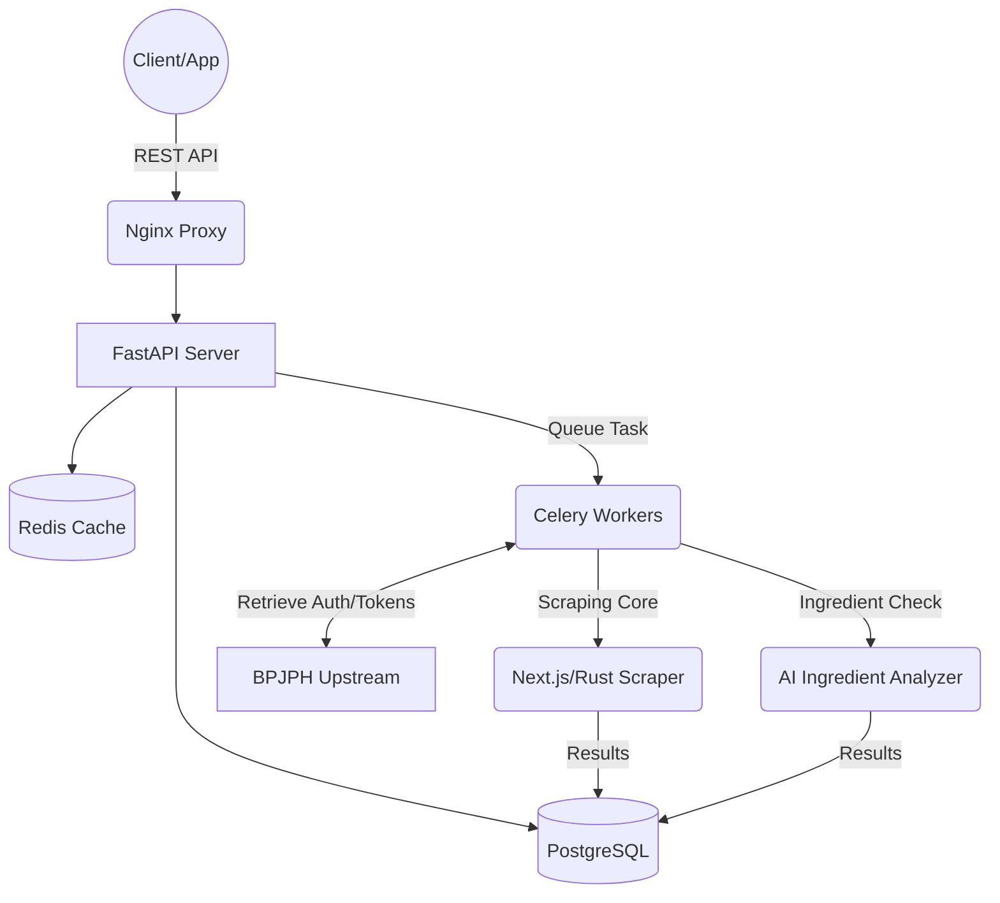

<p align="right">
  <a href="README.md">🇮🇩 Indonesia</a> | <b>🇬🇧 English</b>
</p>

<p align="center">
  
  <br>
  <b>Real-time RESTful API for BPJPH Halal Certificate Verification</b>
  <br>
  Built by <a href="https://halalcheckapi.site">Quorlynix Technology</a> · RapidAPI Ready · v1.0.0
</p>
<p align="center">
  <a href="https://rapidapi.com"></a>
  
  
  
  
</p>

---

## 📖 About the Project

**HalalCheck API** is an enterprise-grade REST architecture built to seamlessly integrate with BPJPH's (Badan Penyelenggara Jaminan Produk Halal) official halal certification data. Built for scale, it handles thousands of queries seamlessly through advanced caching, background queue processing, and machine learning components.

**Live API di RapidAPI Hub https://rapidapi.com/diofikriyanto3321/api/halalcheck-api** 

> **⚠️ DISCLAIMER (UNOFFICIAL):**
> This API is developed independently by **dfchanelxd (Quorlynix Technology)** and is **NOT** affiliated with, sponsored by, or endorsed by BPJPH or the Government of the Republic of Indonesia. Data is collected from public sources solely for educational purposes and developer convenience.

---

## System Architecture

This API is designed using **Microservices-style** background processing and layered caching to ensure sub-second response times even when the upstream sources are slow or unavailable.



---

## Key Features & Technical Highlights

- **High-Performance Scraping Engine:** Core logic powered by a combination of headless automation and Rust, bypassing heavy anti-bot algorithms effectively.
- **Resilient Caching Strategy:** Multi-level caching via Redis ensures repeat queries are served in `~50ms`.
- **Background Worker Processing:** Utilizing Celery + Redis broker to handle long-running ingredient extraction requests without blocking the main event loop.
- **AI-Powered Ingredient Verification:** Analyzes and predicts the halal integrity of non-certified or ambiguous ingredients using an integrated Large Language Model (Anthropic/OpenAI) with high accuracy.
- **Fully Dockerized:** Shipped with `docker-compose` wrapping the API, PostgreSQL, Redis, Celery beat, and Nginx.

---

## Integration Examples

To maintain the security of our internal web-scraping logic and ML pipelines, this repository serves as **documentation and an SDK sandbox**. 

Here are snippets to easily consume the HalalCheck API in your own application:

### Python (Requests)
```python
import requests

url = "https://halalcheck-api.p.rapidapi.com/v1/certificates/search"

querystring = {"query": "Indomie Rasa Kaldu Ayam", "limit": "5"}

headers = {
	"X-RapidAPI-Key": "YOUR_RAPIDAPI_KEY",
	"X-RapidAPI-Host": "halalcheck-api.p.rapidapi.com"
}

response = requests.get(url, headers=headers, params=querystring)
print(response.json())
```

### Node.js (Axios)
```javascript
const axios = require('axios');

const options = {
  method: 'GET',
  url: 'https://halalcheck-api.p.rapidapi.com/v1/certificates/search',
  params: {query: 'Indomie Rasa Kaldu Ayam', limit: '5'},
  headers: {
    'X-RapidAPI-Key': 'YOUR_RAPIDAPI_KEY',
    'X-RapidAPI-Host': 'halalcheck-api.p.rapidapi.com'
  }
};

try {
	const response = await axios.request(options);
	console.log(response.data);
} catch (error) {
	console.error(error);
}
```

---

## 📫 Contact & Custom Enterprise Solutions

For further discussion, custom plans, or collaboration, you can reach out to the developer via:

- ✉️ **Email:** [diofikriyanto3321@gmail.com](mailto:diofikriyanto3321@gmail.com)
- 💬 **WhatsApp (Fast Response):** [Chat with Developer](https://wa.me/6285258880659)

---
*© 2026 Built with ❤️ by dfchanelxd (Quorlynix Technology).*
