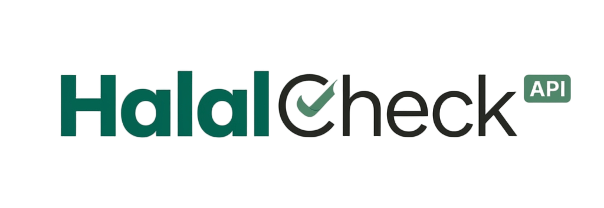
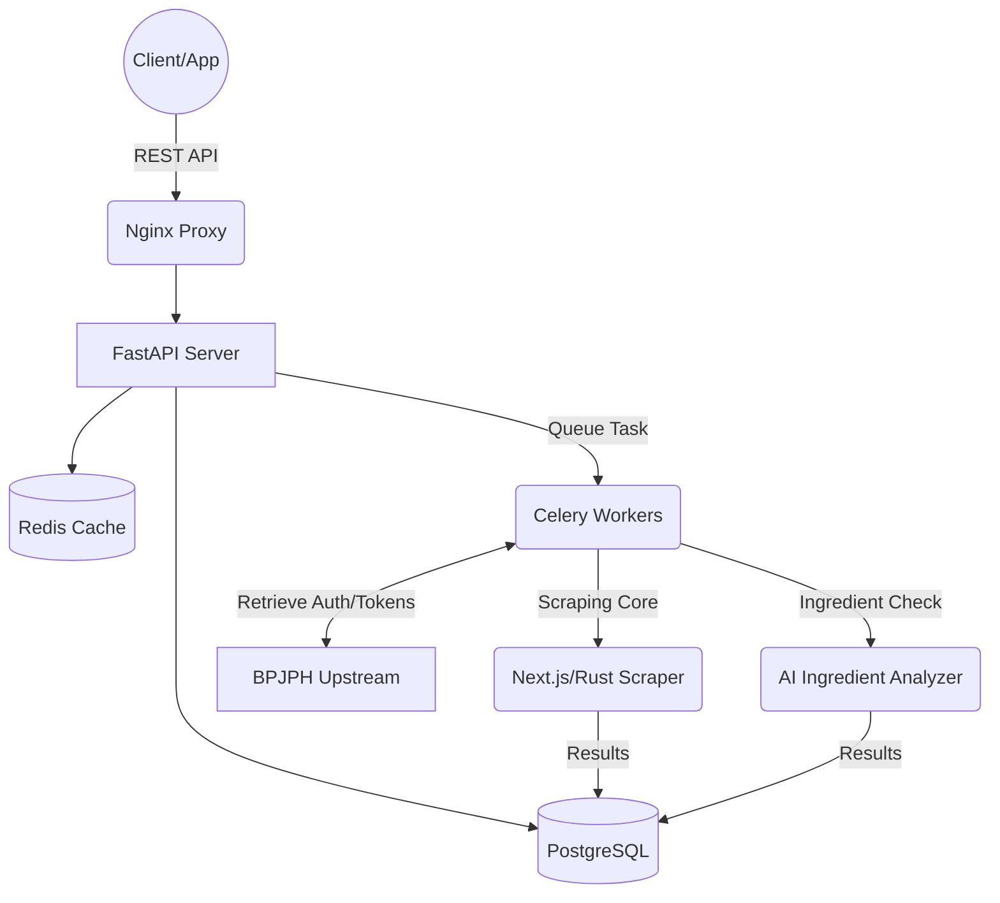

<p align="right">
  <b>🇮🇩 Indonesia</b> | <a href="README.en.md">🇬🇧 English</a>
</p>

<p align="center">
  
  <br>
  <b>RESTful API real-time untuk verifikasi sertifikat halal BPJPH</b>
  <br>
  Built by <a href="https://halalcheckapi.site">Quorlynix Technology</a> · RapidAPI Ready · v1.0.0
</p>
<p align="center">
  <a href="https://rapidapi.com"></a>
  
  
  
  
</p>

---

## 📖 Tentang Project

**HalalCheck API** adalah arsitektur REST kelas enterprise yang dibangun untuk terintegrasi secara mulus dengan data sertifikasi halal resmi BPJPH (Badan Penyelenggara Jaminan Produk Halal). Dirancang untuk skalabilitas tinggi, API ini mampu menangani ribuan kueri dengan efisien melalui caching tingkat lanjut, pemrosesan antrean di latar belakang, dan komponen machine learning.

**[🚀 Live API di RapidAPI Hub]([https://rapidapi.com](https://rapidapi.com/diofikriyanto3321/api/halalcheck-api])** 

> **⚠️ DISCLAIMER (UNOFFICIAL):**
> API ini dikembangkan secara independen oleh **dfchanelxd (Quorlynix Technology)** dan **TIDAK** berafiliasi, disponsori, atau didukung oleh BPJPH atau pemerintah Republik Indonesia. Data diambil dari sumber publik untuk tujuan edukasi dan kemudahan developer.

---

## 🏗️ Arsitektur Sistem

API ini dirancang menggunakan pemrosesan latar belakang bergaya **Microservices** dan caching berlapis untuk memastikan waktu respons di bawah satu detik (sub-second) bahkan saat sumber utama (upstream) lambat atau tidak tersedia.



---

## ✨ Fitur Utama & Keunggulan Teknis

- **High-Performance Scraping Engine:** Logika inti yang ditenagai oleh kombinasi otomatisasi *headless* dan Rust, secara efektif melewati algoritma anti-bot yang berat.
- **Resilient Caching Strategy:** Caching multi-level melalui Redis memastikan kueri berulang disajikan dalam `~50ms`.
- **Background Worker Processing:** Menggunakan Celery + Redis broker untuk menangani ekstraksi bahan (*ingredients*) berdurasi panjang tanpa memblokir event loop utama.
- **AI-Powered Ingredient Verification:** Menganalisis dan memprediksi kehalalan bahan yang belum bersertifikat atau ambigu menggunakan Model Bahasa Besar yang terintegrasi (Anthropic/OpenAI) dengan akurasi tinggi.
- **Fully Dockerized:** Dilengkapi dengan `docker-compose` yang membungkus API, PostgreSQL, Redis, Celery beat, dan Nginx secara utuh.

---

## 💻 Contoh Integrasi

Untuk menjaga keamanan logika *web-scraping* internal dan *pipeline* ML kami, repositori ini berfungsi sebagai **dokumentasi dan *sandbox* SDK**.

Berikut ini adalah *snippet* untuk mengkonsumsi HalalCheck API dengan mudah di aplikasi Anda:

### Python (Requests)
```python
import requests

url = "https://halalcheck-api.p.rapidapi.com/v1/certificates/search"

querystring = {"query": "Indomie Rasa Kaldu Ayam", "limit": "5"}

headers = {
	"X-RapidAPI-Key": "YOUR_RAPIDAPI_KEY",
	"X-RapidAPI-Host": "halalcheck-api.p.rapidapi.com"
}

response = requests.get(url, headers=headers, params=querystring)
print(response.json())
```

### Node.js (Axios)
```javascript
const axios = require('axios');

const options = {
  method: 'GET',
  url: 'https://halalcheck-api.p.rapidapi.com/v1/certificates/search',
  params: {query: 'Indomie Rasa Kaldu Ayam', limit: '5'},
  headers: {
    'X-RapidAPI-Key': 'YOUR_RAPIDAPI_KEY',
    'X-RapidAPI-Host': 'halalcheck-api.p.rapidapi.com'
  }
};

try {
	const response = await axios.request(options);
	console.log(response.data);
} catch (error) {
	console.error(error);
}
```

---

## 📫 Kontak & Solusi Enterprise Kustom

Untuk bisnis yang memerlukan Service-Level Agreement (SLA) khusus, database *dump* offline, atau dataset pelatihan AI khusus:
Silakan hubungi kami melalui bagian Contact Developer di [portal RapidAPI]() kami.

---
*© 2026 Dibuat dengan ❤️ oleh dfchanelxd (Quorlynix Technology).*
